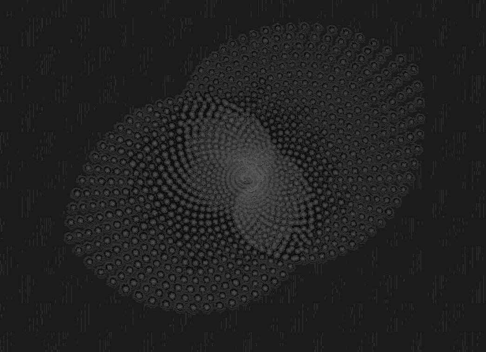

<p align="center">
    
</p>
<h1 align="center">sciagram!</h1>
<p align="center">Fun little ASCII art generation project</p>

## Introduction
With _sciagram_ I aim to create my personal ASCII art generation toolkit. 

I have always loved ASCII art, it just looks beautiful and gives me an odd non-existing nostalgia about the way people expressed art on the internet before I was born. Also, for as long as I can remember, I have wanted to implement an ASCII art generator; and today I was bored, so here goes nothing! I followed [this guide](https://robertheaton.com/2018/06/12/programming-projects-for-advanced-beginners-ascii-art/) and I can't say it was not fun to program.

_sciagram_ has a single dependency - [Pillow](https://pypi.org/project/pillow/), for image modification.

## Usage
This is aimed at a PyPI release, but I haven't really done that yet as the code is still a bit "weak" and not package-worthy. So in caveman-fashion I humbly ask you to generate images manually for now :)
1. Clone the repository locally
   ```bash
   git clone https://github.com/cosmognaut/sciagram.git
   cd sciagram
   ```
2. Move an image of yours to the root folder if you want to run the program from there. You can also do this inside `src/sciagram/`.
   ```bash
   mv sample.jpg path-to-clone/
   ```
3. You can now just use `uv run` to run the program, it will automatically install dependencies for you and activate the virtual environment!
   ```bash
   uv run -m src.sciagram.main
   ```
This "caveman" method will be changed in the future, for sure.

## Ideas
Right now the code is in a very rudimentary stage, so expect a LOT of changes. Some ideas I have been interested in:
1. Restructuring the code so that I can actually use this as a module, this should be easy - just OOP this shit into oblivion.
2. `sciagram` CLI tool for easy generation on the fly.
3. RGB color generation mode. Should be easy with Pillow. I already have the RGB tuples and I just need to wrap each printed character with ANSI escape codes. (PRIORITY)
4. Local brightness exploration, ex. if a terminal cell is 20px by 10px then I could divide the image into blocks of 20x10 pixels and calculate a "local" brightness for that, and use unicode characters this time for brightness. Still B&W but maybe cooler?
5. A mechanism for preserving original image proportions during manipulation. Right now we are following a naive rule where we just scale up/down to `(term_cols, term_rows)`. (PRIORITY)
6. Color inversion - light to dark and dark to light.
